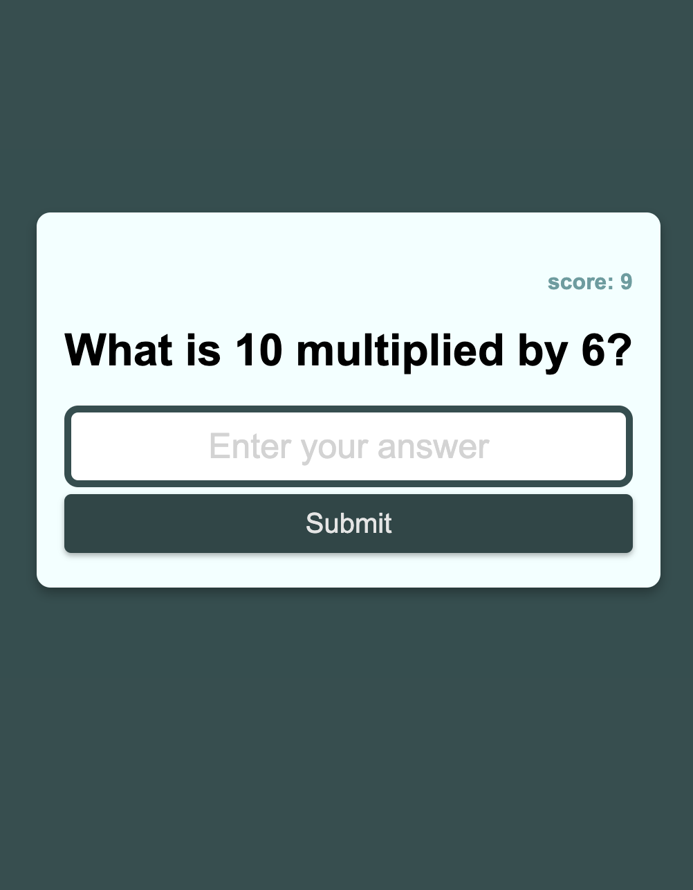

# Multiplication Game Web Application

## Overview

Welcome to the Multiplication Game Web Application! This is a simple web application built using HTML, CSS and JavaScript. Random multiplications are generated between 1-10 as multipliers.

## How to play

* Open the application on your browser using the deployed link.
* You will be presented with a multiplication question.
* In the input, enter what you believe to be the correct answer.
* If correct, your score will increase by 1.
* If incorrect, your score will decrease by 1. 
* Your total score is displayed on the top right.

## Technologies Used

* JavaScript - game logic and functionality
* HTML - game structure and layout
* CSS - game styling

## Contributing

Pull requests are welcome. For major changes, please open an issue first to discuss what you would like to change.

## Mock-Up

The following animation demonstrates the application functionality:

## Links
Deployed project: https://lilyfostergrellis.github.io/multiplication-app/

## License 
Please refer to the LICENSE enclosed in the repository

## Contacts

If you have any questions, please contact me at: 
 
  Github Profile: [Lily Foster-Grellis](https://github.com/Lilyfostergrellis)  

  LinkedIn: [Lily Foster-Grellis](https://www.linkedin.com/in/lily-foster-grellis-l-i-o-n-7ba9751a4/)